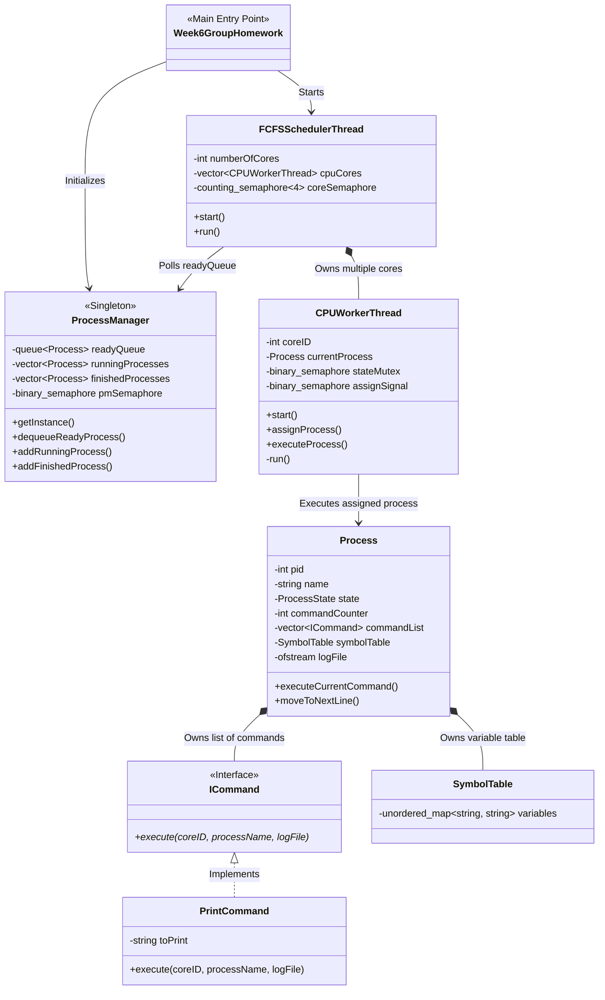
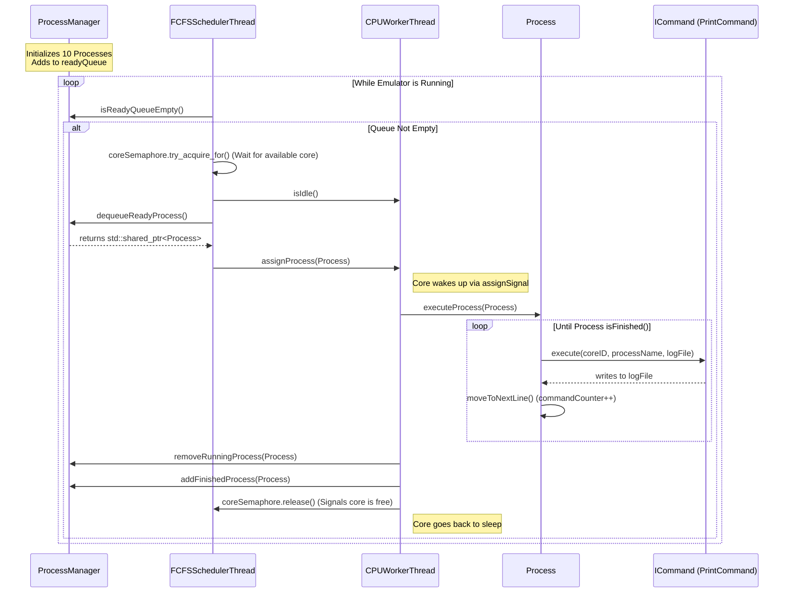

# OS Emulator Architecture

Here is the updated architecture diagram representing your current codebase, including the newly added Command pattern (`ICommand`, `PrintCommand`) and the multi-threaded scheduling system.

## Class Architecture Diagram

This diagram shows the relationships, ownership, and synchronization primitives between the core classes.

## System Workflow (Sequence Diagram)

This sequence diagram illustrates the lifecycle of a Process as it moves from the `ProcessManager`, gets picked up by the `FCFSSchedulerThread`, and is executed by a `CPUWorkerThread`.

